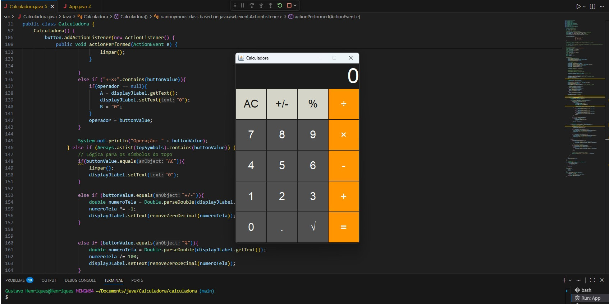

# Calculadora Estilo iPhone

Uma calculadora com interface inspirada no iPhone, desenvolvida em Java.

## Visualização

## Funcionalidades

- Operações básicas: + − × ÷
- Percentual (%), raiz quadrada (√)
- Inversão de sinal (+/−)
- Suporte a números decimais
- Interface com estilo parecido com a do iPhone
